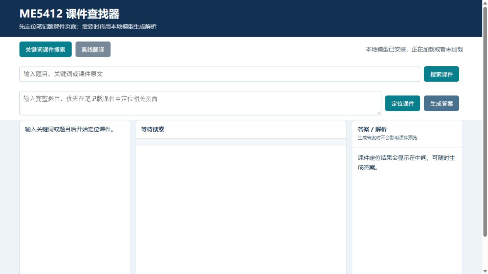
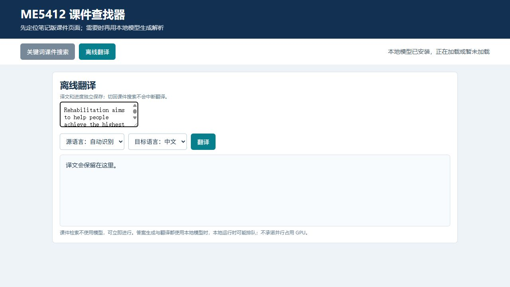

# ME5412 Offline Search / Translation Agent

这是一个面向 Windows 10/11 x64 的 ME5412 课件本地搜索、课件问答和离线翻译工具。便携发布包已经包含 Node.js、Ollama、运行库、应用、索引、知识解析和笔记版课件；普通用户不需要另外安装 Node.js、Ollama、npm，也不需要到其他网页下载依赖。

## 快速开始

1. 下载 [ME5412-offline-agent-win-x64-v1.2.0.zip](https://github.com/kokodayo0208/ME5412-offline-search-translation-agent/releases/download/offline-agent-windows-v1.2.0/ME5412-offline-agent-win-x64-v1.2.0.zip)。不要下载源码 ZIP 代替便携包。
2. 将 ZIP 解压到短路径、可写目录，例如 `D:\ME5412-portable`，不要放在 `Program Files`、同步盘或只读目录。
3. 首次联网时双击 `setup-model.cmd`。它只从本项目 GitHub Release 恢复 `qwen3:8b`，并校验分片和 SHA-256；中断后可重新运行继续。
4. 验证完成后双击 `Start-ME5412.cmd`，浏览器访问本机页面。之后可断网使用搜索、翻译和问答。

发布包 SHA-256：`5207c618b58861917562dccc15b2bb129dd0af11c8a491df97ab75e6e9f754b4`。可下载同一 Release 的校验文件比对；本版本为预发布，完整 AI 生成压力测试尚未完成。

本版本只使用文字模型 `qwen3:8b`，不包含图片识字或视觉模型。截图文字可使用微信支持的本地截图文字提取：截图后在图片预览中右键选择“提取文字”，复制结果并粘贴到本工具。微信是否支持断网取决于具体版本和组件状态；建议先联网登录并成功提取一次，再断网自行验证。微信 OCR 不是本工具的运行依赖，也不需要把截图发送到聊天服务。

## 推荐电脑配置

以下是运行 8B 本地模型的工程建议，不是上游官方保证：

| 项目 | 推荐 | 受限但可能运行 |
| --- | --- | --- |
| 系统 | Windows 10/11 64 位 | Windows 10/11 64 位 |
| CPU | 现代 6–8 核，支持 AVX2 | 4 核以上，CPU-only 会明显更慢 |
| 内存 | 32 GB RAM | 16 GB RAM，需关闭浏览器和其他 AI 程序 |
| GPU | 8 GB VRAM 或更高 | 6 GB VRAM 可能需要降低并发或回退 CPU |
| 磁盘 | SSD，至少 25 GB 可用空间 | 至少 12 GB，空间紧张时不保证安装成功 |

“8B”是模型参数规模，不等于只占 8 GB 内存。运行还需要模型权重、KV cache、上下文（当前默认 4096）、Ollama、Node.js、操作系统和其他程序占用的空间。模型回答仍应回看课件来源，不能把生成结果视为课程或医疗建议。

## 界面流程

以下为本项目的真实本机界面截图，展示启动、课件搜索、课件预览和翻译四个阶段。截图只用于说明 UI 操作流程，不代表所有电脑上的 AI 生成均已通过压力测试；首次运行请以终端的模型加载和校验提示为准。

浏览器的嵌入式 PDF 预览在截图环境中可能显示为黑色；这不表示课件内容不可用。截图用于展示“定位结果、预览与答案栏”的布局，不宣称其中清晰呈现了 PDF 页面内容。

## 版权与使用限制

**仓库中的课件和笔记受版权保护。相关版权归 NUS、原课件作者及其他相应权利人所有。仅限个人、非商业学习使用；严禁任何商业使用、收费售卖、商业培训、产品集成或再分发。公开下载不代表版权转让，也不代表获得商业授权。请勿删除或遮挡课件中的版权标记。**

软件、模型、Node.js、Ollama 和第三方运行库分别受各自上游许可证约束；第三方许可证与课程材料的使用限制相互独立。本声明不是法律意见，也不声称授予超出权利人许可范围的权利。

仓库：[kokodayo0208/ME5412-offline-search-translation-agent](https://github.com/kokodayo0208/ME5412-offline-search-translation-agent)

详细安装、断网测试、故障排查和目录说明见 [`docs/userguide.md`](docs/userguide.md)。
