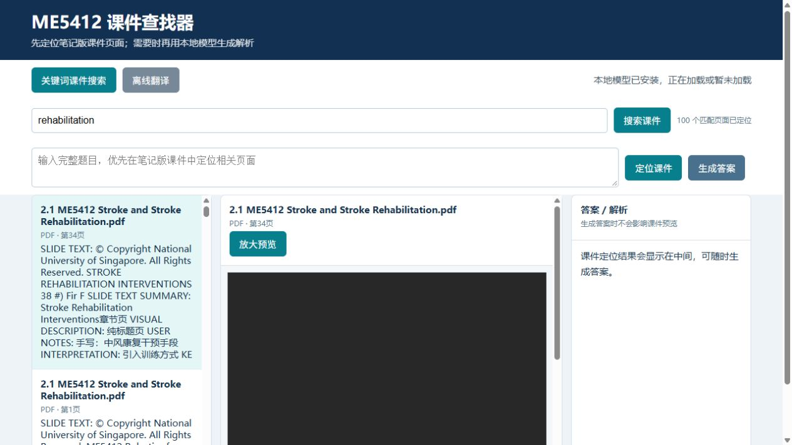
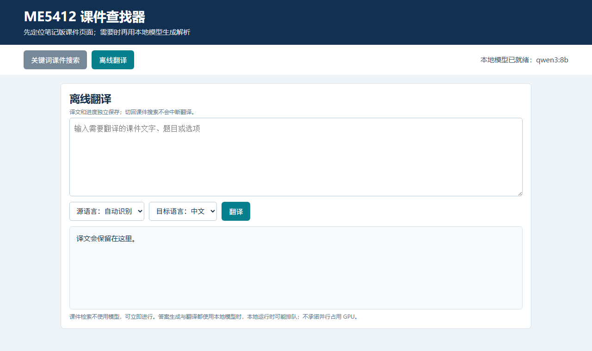

# ME5412 Offline Search / Translation Agent

This repository contains a Windows x64 offline study tool for searching ME5412 course notes, locating the relevant PDF page, generating a Chinese explanation with a local language model, and translating text locally. It is intended for personal study after the initial model download.

## What is included

- A self-contained Windows portable package with the application, Node.js, Ollama, required runtime files, the indexed `course-notes` corpus, and the `qwen3:8b` text model installer.
- Keyword and full-question search with source-page locations.
- A course preview area and a separate answer-output area.
- Independent search/answer and offline-translation workspaces.
- Course-specific visual and reasoning notes used as supplementary context; the model is still expected to verify every answer against the cited course page.

The current package does **not** contain a vision model and does not provide built-in image OCR. For screenshots, use WeChat's “Extract text” feature when available, then paste the extracted text into the search or translation box.

## Quick start (Windows 10/11 x64)

1. Download the portable ZIP from the [GitHub Releases page](https://github.com/kokodayo0208/ME5412-offline-search-translation-agent/releases). Do not substitute the repository's source-code ZIP.
2. Extract it to a short, writable path such as `D:\ME5412-offline-agent`. Avoid `Program Files`, read-only folders, and synchronized folders.
3. On the first run, while GitHub is reachable, double-click `setup-model.cmd`. The setup program downloads the `qwen3:8b` model parts from this repository's Release assets and verifies every part with SHA-256. It does not require Node.js, npm, Ollama, or a download from another website.
4. When setup reports success, double-click `Start-ME5412.cmd`. The browser page opens on the local machine.
5. After the model has been installed and verified, disconnecting from the Internet is supported for search, answer generation, and translation.

The setup can be run again after an interrupted download; verified parts are reused. Do not rename or manually merge model parts.

## Recommended computer configuration

These are practical recommendations for the local 8B model, not a performance guarantee from Qwen or Ollama.

| Component | Recommended | Restricted configuration |
| --- | --- | --- |
| Operating system | Windows 10/11 64-bit | Windows 10/11 64-bit |
| CPU | Modern 6–8 core CPU, AVX2 preferred | 4+ cores; CPU-only is slower |
| System memory | 32 GB RAM | 16 GB RAM may work after closing other heavy programs |
| GPU | 8 GB VRAM or more | 6 GB VRAM may require lower concurrency or CPU fallback |
| Storage | SSD with at least 25 GB free | 12 GB minimum, with no guarantee |

“8B” is the parameter count, not the complete runtime memory requirement. The model, context/KV cache, Ollama, Node.js, the operating system, and the course index all need working space. Close browsers and other AI applications if model loading is slow or fails.

## Interface workflow

1. **Course search**: enter a keyword or a complete question and click the Chinese **搜索课件** (Search course materials) button.
2. **Source review**: select a result, inspect its page location, and open the preview. The answer panel remains available beside the preview.
3. **Generate answer**: click **生成答案** (Generate answer). Treat the model output as a study aid and check the cited source page.
4. **Offline translation**: switch to **离线翻译** (Offline translation), enter text, choose the language direction, and translate. This workspace keeps its own state and can be used independently of search.

The screenshots document the interface stages. They are not a guarantee that every computer will pass a full model-generation stress test.

## Screenshot text extraction

The built-in image/OCR feature has been removed. If a screenshot contains printed text, use WeChat's screenshot text extraction (“Extract text”), copy the result, and paste it into this application. WeChat OCR availability and offline behavior depend on the installed WeChat version and its components; it is optional and is not an application dependency. Test it yourself before relying on it offline.

## Offline and privacy behavior

The application uses local `127.0.0.1` services. After first-time setup, normal search, answer generation, and translation do not require an Internet connection. The setup phase does require GitHub access because it downloads the model archive. The package does not require an account or a separate website download.

## Verification status

The v1.2.0 package was validated end to end from a clean GitHub download: the ZIP SHA-256 matched the published checksum (`5207c618b58861917562dccc15b2bb129dd0af11c8a491df97ab75e6e9f754b4`), extraction succeeded, `setup-model.cmd` restored and verified the single `qwen3:8b` model, and application startup, course search, source-page preview, answer generation, offline translation, and PDF preview were all tested successfully. The model was confirmed running on the GPU (about 4.2 GB VRAM at a 4096 context). This record comes from one specific computer; it is not a universal hardware guarantee.

## Copyright and non-commercial restriction

**The course PDFs, notes, and derived course-content summaries are copyrighted materials. Copyright remains with NUS, the original lecturers/authors, and other applicable rights holders. They are provided only for personal, non-commercial study. Commercial use is strictly prohibited, including sale, paid training, commercial redistribution, product integration, or using the materials in a commercial service. Public availability does not transfer copyright or grant commercial permission. Do not remove or obscure copyright notices.**

The software, model, Node.js, Ollama, and third-party packages remain subject to their respective upstream licenses. Those licenses do not override the course-material restrictions above.

See [`docs/userguide.md`](docs/userguide.md) for installation details, troubleshooting, validation, and the full copyright notice.
